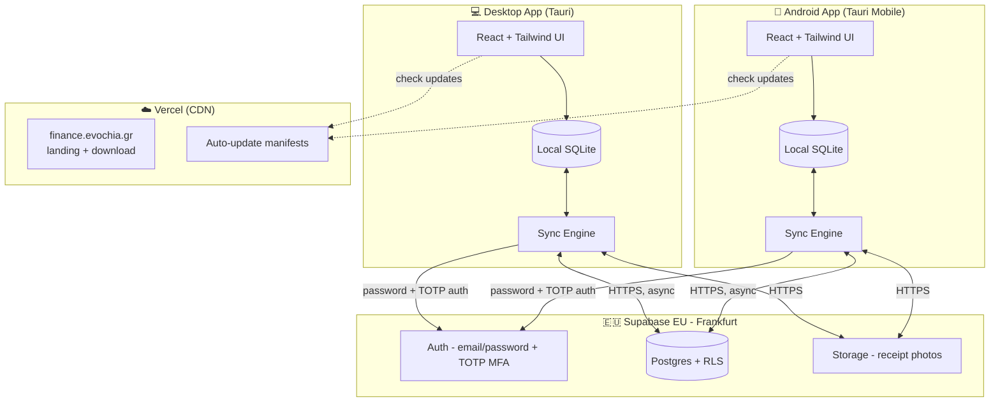
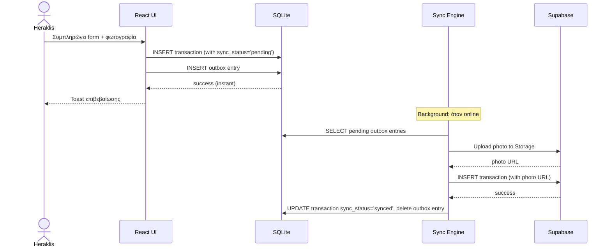
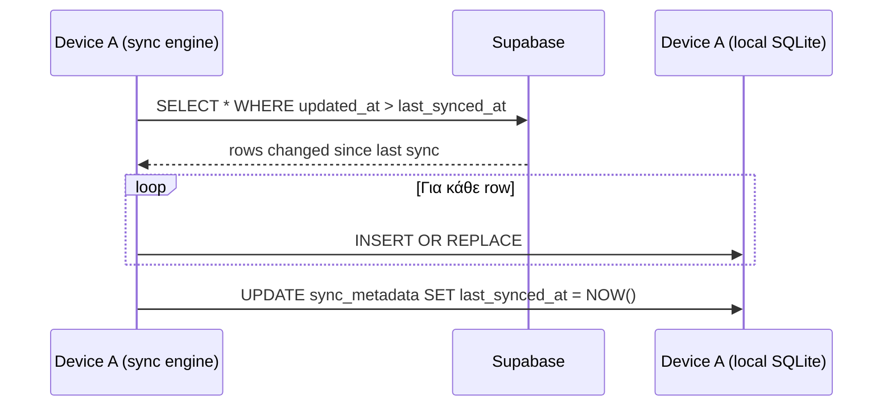
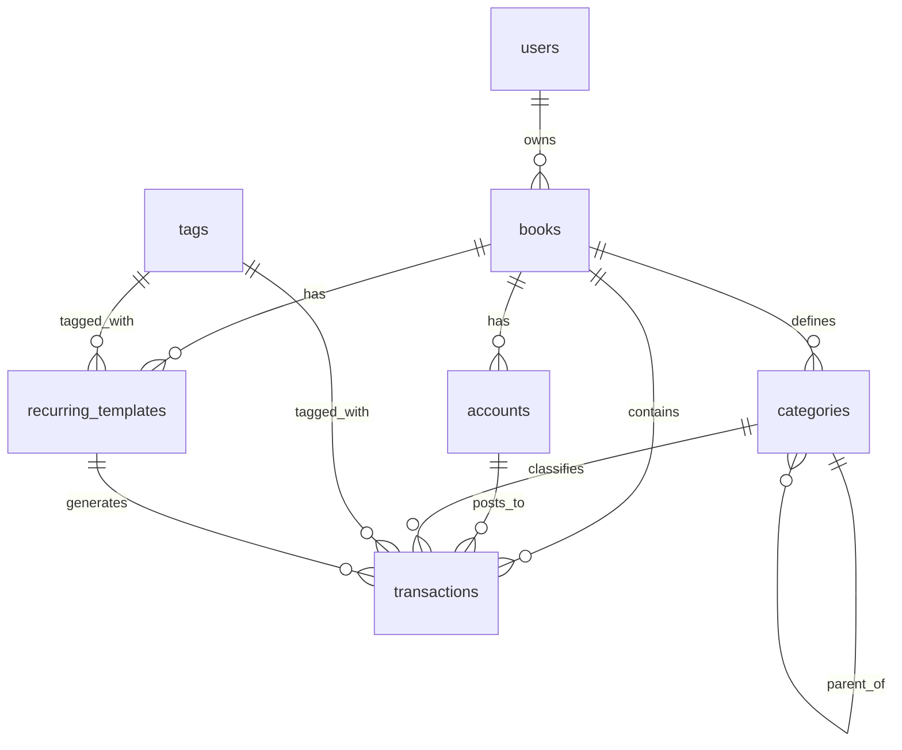

# Evochia Finance — Project Plan

> **Tauri-based desktop + Android app για διαχείριση οικονομικών (Evochia + προσωπικά).**
> **Greek-first · mobile-first · single-user · local-first με sync στο cloud.**

---

**Version:** 1.1
**Ημερομηνία:** 6 Μαΐου 2026
**Owner:** Heraklis (Evochia)
**Document type:** Living plan — αναθεωρείται με κάθε milestone

### Changelog από v1.0
- **Architecture pivot:** Από PWA (Next.js + Supabase) σε **Tauri 2.0 (desktop + Android) + local SQLite + sync σε Supabase**
- **Frontend stack:** Next.js → Vite + React (Tauri requirement)
- **Νέα κρίσιμη συνιστώσα:** Custom sync layer (Option A)
- **Distribution:** Web URL → signed installers + APK + auto-updater
- **Time estimate:** Από 80-120h σε 100-150h
- **Νέο section 6:** Sync Strategy
- **Update sections:** 3, 4, 5, 8, 9, 10, 13

---

## 1. Σκοπός & Όραμα

### Πρόβλημα

Σήμερα η οικονομική παρακολούθηση γίνεται σε Excel templates που:
- Έχουν περιορισμούς στο mobile entry (αργά, χωρίς cascading)
- Δεν υποστηρίζουν receipt photos inline
- Μπερδεύουν business + προσωπικά
- Δεν δίνουν γρήγορη εικόνα ΦΠΑ ή cashflow forecast
- **Δεν δουλεύουν offline** σε χώρους με κακό σήμα (catering events, δρόμος)

### Όραμα

Native app που:
1. Καταχωρώ μια συναλλαγή σε **<30 δευτερόλεπτα από κινητό** χωρίς να περιμένω δίκτυο
2. Φωτογραφίζω την απόδειξη με native camera, αποθηκεύεται τοπικά, sync στο cloud αργότερα
3. Δουλεύει ίδια καλά σε desktop όταν θέλω αναλύσεις
4. Διαχωρίζει business/personal με ένα switch
5. Συγχρονίζει αυτόματα data μεταξύ desktop και Android
6. Εξάγει .xlsx για τον λογιστή τριμηνιαία

### Non-goals

- Δεν αντικαθιστά λογιστή ή λογιστικό πρόγραμμα
- Δεν συνδέεται απευθείας στο myDATA σε αυτή τη φάση
- Δεν είναι multi-user — μόνο ο Heraklis
- Δεν είναι customer-facing (δεν εκδίδει τιμολόγια)
- Δεν στοχεύει iOS σε αυτή τη φάση (μελλοντικά αν προκύψει)
- Δεν διανέμεται μέσω Google Play (sideload για single user)

---

## 2. Κριτήρια Επιτυχίας

| # | Κριτήριο | Πώς μετριέται |
|---|---|---|
| 1 | Καταχώρηση transaction σε <30s offline | Self-test |
| 2 | Recurring auto-generation (ενοίκιο, ΔΕΗ, ΕΥΔΑΠ) | Δεν χρειάζεται manual entry |
| 3 | Receipt photo σε <3 taps | UX test |
| 4 | Sync desktop ↔ Android <60s όταν online | Cross-device test |
| 5 | Excel export για λογιστή σε <10s | Click-to-download |
| 6 | Συμμόρφωση GDPR (EU residency) | Audit |
| 7 | Maintenance <2h/μήνα | Steady state |
| 8 | Forecast accuracy ±10% για στατικό μήνα | Σύγκριση μετά 3 μήνες |
| 9 | **Νέο:** Δουλεύει χωρίς internet για απεριόριστα reads/writes | Functional test |

---

## 3. Tech Stack

### App Shell

- **Tauri 2.0** (Rust) — desktop (Windows/Mac/Linux) + Android
- Webview rendering (system webview, όχι bundled Chromium → small binaries)

### Frontend

- **Vite 5** — fast dev, fast builds, no SSR (Tauri requirement)
- **React 18** + **TypeScript strict**
- **Tailwind CSS v4** + **shadcn/ui**
- **react-hook-form** + **zod** για forms & validation
- **Recharts** για charts
- **TanStack Query** για state + sync orchestration
- **Lucide icons** (ή custom SVGs για Evochia accents)

### Local Data Layer

- **SQLite** (via `tauri-plugin-sql` ή `rusqlite` direct)
- **Drizzle ORM** ή plain SQL με typed wrappers
- Schema migrations on app startup

### Remote / Sync

- **Supabase EU (Frankfurt)**
  - Postgres 15 — sync target
  - Auth (email/password + TOTP MFA)
  - Storage για receipt photos
  - Edge Functions για scheduled jobs (server-side recurring generation as backup)
- **Custom sync layer** — outbox pattern, pull/push, conflict resolution per single-user simplifications

### Tauri Plugins

- `tauri-plugin-sql` — SQLite access
- `tauri-plugin-fs` — file system για receipts
- `tauri-plugin-os` — platform detection
- `tauri-plugin-camera` (community) ή custom για Android camera
- `tauri-plugin-updater` — auto-updates
- `tauri-plugin-notification` — local notifications (recurring reminders)
- `tauri-plugin-dialog` — file save dialog για Excel export

### Hosting & DevOps

- **Vercel** για static landing/download page στο `finance.evochia.gr`
- **GitHub** private repo `heraklist/evochia_finance`
- **GitHub Actions** για CI: build desktop installers + signed Android APK
- **Sentry** για error tracking
- **Cloudflare R2** ή Vercel για hosting installers + auto-update manifests

### Tooling

- **pnpm** package manager
- **Cargo** για Rust deps
- **Biome** για JS/TS linting + formatting
- **Vitest** για unit tests (κρίσιμα: VAT computation, sync logic, recurring generation)
- **Playwright** για E2E στο desktop build

### Rationale για κάθε σημαντική επιλογή

| Επιλογή | Γιατί |
|---|---|
| Tauri vs Electron | 10x μικρότερο binary, καλύτερη performance, native integrations μέσω Rust |
| Tauri vs React Native | Έχει πραγματικό desktop support, share frontend code, Rust ecosystem |
| Vite vs Next.js | Tauri χρειάζεται static frontend (no SSR), Vite faster dev experience |
| SQLite vs IndexedDB | Reliable local storage, no quota limits, real SQL queries, παγωμένο schema |
| Custom sync vs PowerSync | Single user → trivial conflicts, less dependency surface |
| shadcn/ui vs MUI/Chakra | Components owned in our codebase, no library lock-in, design tokens consistent |

---

## 4. Αρχιτεκτονική Συστήματος

### High-level diagram



### Local-first data flow — προσθήκη συναλλαγής



### Pull sync flow — άλλη συσκευή έχει νέα δεδομένα



---

## 5. Data Model

### Entities & relationships (αμετάβλητο από v1.0)



### Παράλληλο schema σε SQLite + Postgres

Το ίδιο schema τρέχει σε δύο places. Differences:
- **SQLite local**: επιπλέον στήλες `sync_status`, `local_updated_at`, `server_updated_at`
- **Postgres remote**: generated columns για VAT/Net (όπως v1.0), RLS policies

### SQL schema (Postgres — ίδιο με v1.0)

```sql
-- Books, accounts, categories, tags, recurring_templates, transactions
-- (αμετάβλητο από v1.0 — δες προηγούμενη version για πλήρες schema)

-- Generated columns για VAT (αμετάβλητα)
amount_vat numeric(12,2) generated always as
  (amount_gross - amount_gross / (1 + vat_rate)) stored,
amount_net numeric(12,2) generated always as
  (amount_gross / (1 + vat_rate)) stored,
```

### SQLite schema (νέο)

```sql
-- Mirror του Postgres schema, με 3 επιπλέον στήλες παντού:
-- sync_status: 'pending' | 'synced' | 'error'
-- local_updated_at: timestamp τοπικής τροποποίησης
-- server_updated_at: timestamp τελευταίου sync με server

CREATE TABLE transactions (
  id TEXT PRIMARY KEY,  -- UUID, generated locally
  date TEXT NOT NULL,
  description TEXT NOT NULL,
  book_id TEXT NOT NULL,
  account_id TEXT NOT NULL,
  category_id TEXT NOT NULL,
  tag_id TEXT,
  payment_method TEXT NOT NULL,
  amount_gross REAL NOT NULL,
  vat_rate REAL NOT NULL DEFAULT 0.24,
  amount_vat REAL NOT NULL,  -- computed in app, stored
  amount_net REAL NOT NULL,  -- computed in app, stored
  receipt_photo_path TEXT,   -- local path OR remote URL after sync
  recurring_template_id TEXT,
  notes TEXT,
  created_at TEXT NOT NULL,
  updated_at TEXT NOT NULL,
  -- Sync columns
  sync_status TEXT NOT NULL DEFAULT 'pending',
  local_updated_at TEXT NOT NULL,
  server_updated_at TEXT
);

-- Outbox: queue of changes pending sync
CREATE TABLE sync_outbox (
  id INTEGER PRIMARY KEY AUTOINCREMENT,
  entity_type TEXT NOT NULL,    -- 'transaction', 'category', etc.
  entity_id TEXT NOT NULL,
  operation TEXT NOT NULL,       -- 'create', 'update', 'delete'
  payload TEXT NOT NULL,         -- JSON
  attempts INTEGER DEFAULT 0,
  last_error TEXT,
  created_at TEXT NOT NULL
);

-- Sync metadata
CREATE TABLE sync_metadata (
  key TEXT PRIMARY KEY,
  value TEXT NOT NULL
);
-- Stores: last_synced_at, current_user_id, etc.

-- Indexes
CREATE INDEX idx_tx_date ON transactions(date DESC);
CREATE INDEX idx_tx_sync ON transactions(sync_status) WHERE sync_status='pending';
CREATE INDEX idx_outbox_pending ON sync_outbox(created_at);
```

### RLS policies (Postgres — αμετάβλητα από v1.0)

Όλα τα tables: deny-by-default + policies για `auth.uid() = user_id`.

---

## 6. Sync Strategy (νέο section)

### Πρόβλημα

Έχουμε δύο SQLite databases (desktop + Android) που πρέπει να μένουν σε sync με Postgres στο Supabase. Single user → δεν έχουμε real conflicts (ο ίδιος χρήστης δεν επεξεργάζεται την ίδια εγγραφή ταυτόχρονα από δύο συσκευές). Αλλά μπορεί:
- Να δουλεύει offline σε mobile
- Μετά να ανοίγει desktop και να κάνει αλλαγές
- Σύνδεση internet έρχεται σε άγνωστη χρονική στιγμή
- Συσκευή να καταρρεύσει — απαιτείται restoration

### Approach: Outbox + last-write-wins με timestamps

**Εγγραφές (push):**
1. Κάθε mutation γράφεται **πρώτα στο SQLite** (instant, never blocks UI)
2. Παράλληλα προστίθεται entry στο `sync_outbox`
3. Sync engine (background, polling κάθε 30s όταν online) διαβάζει το outbox
4. Ανεβάζει αλλαγές σε batch στο Postgres
5. Αν επιτύχει → marks transaction synced + deletes outbox entry
6. Αν αποτύχει → increments attempts, exponential backoff

**Αναγνώσεις (pull):**
1. Sync engine ζητάει `SELECT * FROM <table> WHERE updated_at > last_synced_at`
2. Για κάθε row, `INSERT OR REPLACE` στο SQLite
3. Remote rows με `deleted_at` λειτουργούν ως tombstones και διαγράφουν/αποσυνδέουν το αντίστοιχο local row
4. Update `last_synced_at` μόνο όταν όλα τα table pulls πετύχουν, και μόνο μέχρι το μεγαλύτερο remote `updated_at` που εφαρμόστηκε/αναγνωρίστηκε

**Conflict resolution (single user):**
- Current implementation: timestamp-based LWW. Before push, the sync engine compares local `local_updated_at`/`updated_at` with server `updated_at`; older local pushes are skipped and the outbox entry is resolved so the following pull can apply the newer server row. During pull, rows are not applied over a newer local `local_updated_at`.
- Deletes are timestamped soft-deletes remotely (`deleted_at`) so other devices can pull deletion tombstones; hard local deletion remains okay because the outbox payload carries the delete timestamp.
- Αν local έχει `local_updated_at > server_updated_at` και remote άλλαξε επίσης → last-write-wins με `local_updated_at`
- Στην πράξη σπάνιο: ο ίδιος χρήστης δεν επεξεργάζεται την ίδια εγγραφή σε δύο devices ταυτόχρονα
- Αν συμβεί, η πιο πρόσφατη edit κερδίζει
- Όλα τα conflicts logged για audit

**Receipt photos:**
- Αρχικά αποθηκεύονται τοπικά σε `app_data_dir/receipts/{uuid}.jpg`
- Sync engine ανεβάζει σε Supabase Storage όταν online
- Μετά το upload, `receipt_photo_path` ενημερώνεται με remote URL
- Local file διαγράφεται μετά από 30 μέρες (cache cleanup)

**Initial sync (first install):**
- Login με email/password
- MFA challenge με authenticator όταν υπάρχει enrolled TOTP factor
- Pull όλο το σύνολο δεδομένων από Postgres → SQLite
- Mark `last_synced_at`
- App ready

**Network state UI:**
- Header indicator: "Συγχρονίστηκε πριν 5 λεπτά" / "Offline · 3 αλλαγές εκκρεμούν"
- Manual "Sync now" button στο Settings

### Estimated implementation effort

- Outbox table + insertion hooks: 2h
- Background sync worker: 4h
- Pull logic με last_synced_at: 2h
- Photo upload async + retry: 3h
- Conflict resolution: 1h
- UI indicators: 2h
- Tests: 4h
- **Total: ~18-20h**

---

## 7. User Flows

### Flow 1: Καταχώρηση offline (catering στη Λαχαναγορά πρωί)

```
Tap home icon (Android)
  → Quick Add screen ανοίγει instant (local-first)
  → Συμπληρώνεις form, τραβάς φωτογραφία απόδειξης
  → Tap "Καταχώρηση"
  → Toast: "Αποθηκεύτηκε τοπικά. Θα συγχρονιστεί όταν συνδεθείς."
  → UI επιστρέφει στο Dashboard με τη νέα εγγραφή visible
  
Αργότερα στο σπίτι:
  → App detects WiFi
  → Sync engine ανεβάζει 5 pending εγγραφές + 5 photos
  → Toast: "Συγχρονίστηκαν 5 εγγραφές"
```

### Flow 2: Cross-device experience

```
Πρωί στη Λαχαναγορά (Android offline)
  → Καταχωρείς 3 εγγραφές αγορών
  
Μεσημέρι σπίτι (Android online)
  → Auto-sync, push σε Supabase
  
Απόγευμα στο γραφείο (Desktop)
  → Ανοίγεις app
  → Auto-sync, pull από Supabase
  → Βλέπεις τις 3 εγγραφές
  → Επεξεργάζεσαι μία (διορθώνεις ποσό)
  → Local update + outbox entry
  → Sync push σε Supabase
  
Επόμενη μέρα (Android online)
  → Auto-sync, pull
  → Βλέπεις την ενημέρωση
```

### Flow 3-6: αμετάβλητα από v1.0

- Αναζήτηση παλιάς συναλλαγής
- Μηνιαία ανασκόπηση
- Έκδοση για λογιστή
- Recurring management

---

## 8. UI / Screen Plan

### Screens (αμετάβλητα από v1.0)

| # | Screen | Route (logical) | Priority |
|---|---|---|---|
| 1 | Login (email/password + MFA) | `/login` | P0 |
| 2 | Dashboard / Home | `/` | P0 |
| 3 | Add Transaction | `/add` | P0 |
| 4 | Transactions list | `/transactions` | P0 |
| 5 | Transaction detail/edit | `/transactions/:id` | P0 |
| 6 | Categories management | `/categories` | P1 |
| 7 | Accounts management | `/accounts` | P1 |
| 8 | Tags management | `/tags` | P1 |
| 9 | Recurring templates | `/recurring` | P1 |
| 10 | VAT summary | `/vat` | P2 |
| 11 | Forecast | `/forecast` | P2 |
| 12 | Settings + Export | `/settings` | P2 |

### Νέα στοιχεία UI (Tauri-specific)

- **Sync status bar** στην κεφαλίδα: εμφανίζει "Online" / "Offline" / "Syncing..."
- **Sync conflict resolution dialog** (rare, αλλά πρέπει να υπάρχει)
- **App update notification** όταν νέα έκδοση είναι διαθέσιμη
- **Native menu bar** σε desktop (File, Edit, View, Help)
- **System tray icon** (optional, Phase 3)

Detailed visual design είναι σε ξεχωριστό **Claude Design Brief** document.

---

## 9. Roadmap

### Phase 1 — Foundation (~3-4 μέρες)

**Στόχος:** End-to-end working local app — μπορώ να καταχωρώ και να βλέπω, χωρίς sync ακόμα.

- [ ] Tauri 2.0 project scaffolding (cargo + Vite)
- [ ] React + Tailwind + shadcn setup
- [ ] SQLite migrations system
- [ ] Schema deployment (όλα τα tables)
- [ ] Add Transaction page (mobile-first form)
- [ ] Transactions list με βασικά filters
- [ ] Dashboard με 4 KPI tiles + monthly bar chart
- [ ] Build pipeline: desktop installers (Win/Mac/Linux) + Android APK
- [ ] First sideload δοκιμή σε Android device

**DoD:** Καταχωρώ 5 πραγματικές εγγραφές στο Android, βλέπω τα totals σωστά στο Dashboard. Δεν υπάρχει ακόμα sync — local only.

### Phase 2 — Sync & Cloud (~3-4 μέρες)

**Στόχος:** Cross-device functional.

- [ ] Supabase project setup + RLS policies
- [ ] Password auth + TOTP MFA integration στο Tauri
- [ ] Outbox table + write hooks
- [ ] Background sync engine (push + pull)
- [ ] Conflict resolution logic
- [ ] Network state UI indicators
- [ ] Manual "Sync now" action
- [ ] Receipt photo upload flow
- [ ] Sync tests (unit + manual cross-device)

**DoD:** Κάνω αλλαγή σε desktop, βλέπω σε Android μέσα σε 60s. Offline καταχώρηση συγχρονίζεται όταν επιστρέφει το internet.

### Phase 3 — Automation (~3-4 μέρες)

**Στόχος:** Λιγότερη χειρωνακτική δουλειά.

- [ ] Recurring templates CRUD UI
- [ ] Daily check για due recurring (local + Edge Function backup)
- [ ] Tags management + autocomplete
- [ ] Native camera integration (Tauri plugin)
- [ ] Cascading dropdowns: Book → Account / Category → Subcategory
- [ ] Categories management UI (tree view)
- [ ] Accounts management με computed balances
- [ ] Search σε transactions

**DoD:** Όλα τα πάγια έξοδα γεννιούνται αυτόματα. Tag "Cold Kitchen Project" μου δίνει P&L εκδήλωσης.

### Phase 4 — Intelligence & Polish (~5-7 μέρες)

**Στόχος:** "Έτοιμο για λογιστή" + premium feel.

- [ ] VAT summary page (τριμηνιαία)
- [ ] Forecast engine (recurring + scheduled events + linear projection)
- [ ] Excel export για λογιστή (.xlsx με 3 sheets) — μέσω native file dialog
- [ ] Bulk import από Excel (μετάβαση historical data)
- [ ] Charts σε όλες τις σελίδες (Recharts)
- [ ] Settings page πλήρης
- [ ] Performance optimization
- [ ] Auto-updater setup + first signed release
- [ ] E2E tests για κρίσιμα flows
- [ ] Visual polish per Claude Design Brief

**DoD:** Στέλνω στον λογιστή .xlsx τριμήνου με ένα click. Auto-update δουλεύει. App νιώθει "premium".

### Phase 5+ (post-MVP)

- iOS port (αν προκύψει ανάγκη)
- myDATA awareness (διαβίβαση τιμολογίων από ΑΑΔΕ)
- Budgeting per category
- Multi-currency
- AI categorization suggestions
- Voice entry μέσω Tauri shortcuts

---

## 10. Ασφάλεια & Συμμόρφωση

### Authentication

- Email/password μέσω Supabase Auth
- TOTP MFA μέσω Microsoft Authenticator ή συμβατού authenticator app
- Token stored in OS keychain (macOS Keychain / Windows Credential Manager / Android Keystore) μέσω `tauri-plugin-stronghold` ή native APIs
- Session 30 μέρες, auto-renewal
- 2FA: enforce σε Supabase + GitHub + email

### Local data protection (νέο)

- **SQLite database encryption**: αξιολόγηση SQLCipher (Phase 4) — αν θέλουμε encrypted local DB
- **Auto-lock**: app κλειδώνει μετά από inactivity (Phase 4)
- **Receipt photos** σε app data directory (sandboxed)
- **No data leakage** σε system logs

### Network data protection

- **Supabase EU/Frankfurt** — GDPR compliant
- **TLS 1.3** in transit
- **At-rest encryption** στο Supabase
- **RLS σε όλους τους πίνακες** — deny-by-default
- **Service role key**: ΠΟΤΕ στο Tauri client. Μόνο σε Edge Functions (server-side).
- **Anon key**: embedded στο app (acceptable, RLS προστατεύει)

### Backup strategy

- **Supabase auto-backup**: 7 μέρες (free tier)
- **Local SQLite backup**: αυτόματο copy κάθε εβδομάδα σε `~/Documents/Evochia_Backups/`
- **Manual pg_dump** σε προσωπικό drive μηνιαία
- **Excel export μηνιαίο**: επιπλέον backup format

### Code signing

- **Desktop installers**: signed με self-signed cert αρχικά (warning στο Windows acceptable για personal use), κανονικό cert αν θες to αργότερα
- **Android APK**: signed με personal keystore. Keystore backup σε secure location (1Password/Bitwarden).
- **Auto-updates**: signature verification πριν την εφαρμογή

### Threat model

| Απειλή | Mitigation |
|---|---|
| Email account compromise | 2FA σε email + Supabase |
| Local device theft | OS-level encryption + (Phase 4) app-level encryption |
| Supabase breach | RLS + minimal stored PII |
| Anon key abuse | RLS + rate limiting |
| Malicious update | Signed updates μόνο, public key embedded |
| Lost Android keystore | Backup σε 1Password πριν first release |

---

## 11. Operations

### Build pipeline

- **Local dev**: `pnpm tauri dev` (desktop), `pnpm tauri android dev` (Android)
- **CI/CD via GitHub Actions**:
  - Trigger: push σε `main` branch ή tagged release
  - Jobs:
    - `lint` — Biome
    - `test` — Vitest
    - `build-desktop` — matrix (Windows/Mac/Linux)
    - `build-android` — APK signing με secrets
    - `release` — upload σε GitHub Releases + auto-update manifest σε Vercel/R2

### Auto-updater

- Tauri's built-in updater
- Check on app start + once daily
- Manifest στο `https://finance.evochia.gr/update.json`
- Updates downloaded in background, applied on next launch
- User notification όταν νέα έκδοση διαθέσιμη

### Distribution

- **Desktop**: download links από `https://finance.evochia.gr`
  - Windows: `.msi` installer
  - macOS: `.dmg` (universal binary για Intel + Apple Silicon)
  - Linux: `.AppImage` ή `.deb`
- **Android**: signed `.apk` με instructions για sideload
  - Settings → Security → Allow install from unknown sources
  - Download από `finance.evochia.gr/android`

### Monitoring

- **Errors**: Sentry alerts
- **Update adoption**: Track via auto-updater check requests
- **Sync failures**: Local logs + opt-in remote logging

### Maintenance tasks (recurring)

- **Εβδομαδιαία (5 λεπτά)**: review Sentry errors
- **Μηνιαία (45 λεπτά)**: pg_dump + local SQLite backup, dependency audit, security patches
- **Τριμηνιαία (2 ώρες)**: Tauri/Rust deps update + test, signed release
- **Ετήσια (3 ώρες)**: rotate keys, recheck RLS policies, Apple/Google policy updates

---

## 12. Κόστος

### Monthly recurring (€)

| Service | Free tier | Heraklis usage | Cost |
|---|---|---|---|
| Vercel Hobby | Unlimited deploys, 100GB bandwidth | <1GB | **0** |
| Supabase Free | 500MB DB, 1GB storage, 2GB bandwidth | <100MB DB, <500MB storage | **0** |
| GitHub Free | Unlimited private repos + Actions | 1 repo, ~500 min/μήνα | **0** |
| Domain `evochia.gr` | — | Subdomain | **0** |
| Sentry Free | 5K errors/month | <100 | **0** |
| Code signing cert (optional) | — | Self-signed για τώρα | **0** |

**Total: 0 €/μήνα**

### One-time costs

- Optional desktop code signing cert (αν θες όχι warning σε Windows): ~$300/χρόνο
- Apple Developer Program (μόνο αν αργότερα θες iOS): $99/χρόνο

### Time investment

- **Phase 1**: ~24-32h
- **Phase 2**: ~24-32h
- **Phase 3**: ~24-32h
- **Phase 4**: ~32-48h
- **Total Phase 1-4**: ~104-144h
- **Steady-state maintenance**: ~2h/μήνα

---

## 13. Migration & Integration

### Από Excel σε νέο σύστημα

**Phase 4**: Bulk import από `Ετήσια_Οικονομικά_.xlsx` ή παρόμοιο. Parser στο app διαβάζει sheets, transforms σε transactions schema, preview screen, confirm → bulk INSERT τοπικά + sync.

### Με τον λογιστή

- **Έξοδος**: native file dialog → Excel export (.xlsx) τριμηνιαία με transactions + VAT summary + categories breakdown
- **Είσοδος**: μονόδρομη — ο λογιστής δεν στέλνει data πίσω

### Future integrations

- myDATA (read-only sync τιμολογίων)
- Bank feeds (αν PSD2 διαθέσιμο)
- POS integration για catering events

---

## 14. Risks & Mitigations

| Risk | Likelihood | Impact | Mitigation |
|---|---|---|---|
| Sync logic bugs (data loss/corruption) | Medium | **Critical** | Extensive unit tests + soft-delete pattern + local backups |
| Android Tauri 2.0 maturity issues | Medium | High | Test core flows early σε Android, fallback PWA web view αν needed |
| Lost Android keystore | Low | **Critical** | Keystore backup σε 1Password πριν release |
| Update mechanism fails | Low | High | Manual override (re-download installer) ως escape hatch |
| Maintenance burden νικά motivation | Medium | High | Phasing + continuous deployment από Phase 1 |
| Native camera plugin issues | Medium | Medium | Test early, fallback file picker |
| Διαρροή keys σε public repo | Medium | High | Repo private, secret scanning hook |
| Forgotten RLS policy | Medium | High | Test suite που verifies isolation |
| Cross-device sync conflicts (rare) | Low | Medium | Last-write-wins + conflict log |
| Browser quirks (webview) σε Android | Medium | Medium | Test on real device per phase |
| Rust learning curve για new features | Low | Low | Heraklis έχει experience από Tauri ham radio app |

---

## 15. Open Decisions (locked from v1.0)

✓ Domain: `finance.evochia.gr`
✓ Repo: `heraklist/evochia_finance` (private)
✓ Excel export: ναι, Phase 4
✓ Phasing: continuous deployment, sequential
✓ Architecture: **Tauri (desktop + Android)** με local SQLite + custom sync
✓ Sync strategy: **Option A (custom)**

### New decisions to make

| # | Decision | Default αν δεν αποφασιστεί |
|---|---|---|
| 1 | Code signing cert για Windows | Self-signed (warning OK για personal use) |
| 2 | SQLite encryption (SQLCipher) | Όχι αρχικά, αξιολόγηση Phase 4 |
| 3 | App-level auto-lock | Όχι αρχικά, αξιολόγηση Phase 4 |
| 4 | Local backup location | `~/Documents/Evochia_Backups/` |
| 5 | Sync polling interval | 30 δευτερόλεπτα όταν online |
| 6 | Branch protection rules στο GitHub | main protected, PR-only merges |

---

## 16. Επόμενες Ενέργειες

### Πριν ξεκινήσω coding (Heraklis ~30 λεπτά)

- [ ] Δημιούργησε Supabase project (EU/Frankfurt, name `evochia-finance`)
  - Δώσε μου: Project URL + Anon/Public key
  - **ΜΗΝ** στείλεις service_role key
- [ ] Δημιούργησε GitHub repo `heraklist/evochia_finance` (private, README + Node .gitignore)
  - Δώσε μου URL
- [ ] 2FA enabled σε Supabase, GitHub, Vercel, email
- [ ] **Νέο για Tauri**: εγκατέστησε Rust toolchain (`rustup`) τοπικά αν δεν έχεις ήδη
- [ ] **Νέο για Android**: εγκατέστησε Android Studio + Android SDK + NDK αν δεν έχεις ήδη

### Phase 1 Day 1-4

- Day 1: Tauri scaffolding, Vite + React + Tailwind, SQLite plugin setup
- Day 2: Schema migrations, seed data, type-safe DB layer
- Day 3: Add Transaction screen + Transactions list
- Day 4: Dashboard + first build (desktop + Android)

### Continuous deployment από εδώ και πέρα

Κάθε έτοιμο feature → tagged release → auto-update push σε όλες τις installed instances.

---

## Appendix A — Greek copy reference (αμετάβλητο από v1.0)

[Δες v1.0 για πλήρη λίστα κατηγοριών, accounts, payment methods, VAT rates]

---

## Appendix B — Tauri-specific glossary (νέο)

- **Tauri webview** — system-provided browser engine που τρέχει το frontend (WKWebView σε macOS, WebView2 σε Windows, WebKitGTK σε Linux, Android WebView σε Android)
- **Cargo** — Rust's package manager + build tool
- **rustup** — Rust toolchain installer
- **Tauri plugin** — Rust crate που εκθέτει native APIs στο frontend μέσω IPC
- **Outbox pattern** — design pattern για reliable message delivery: γράφεις σε local DB + outbox table σε ίδια transaction, async worker διαβάζει outbox και ανεβάζει στο remote
- **Last-write-wins (LWW)** — conflict resolution strategy: η εγγραφή με μεγαλύτερο timestamp κερδίζει
- **APK signing** — Android-specific cryptographic signing που εξασφαλίζει αυθεντικότητα του installer
- **Auto-update manifest** — JSON αρχείο που λέει στον updater "νέα έκδοση X.Y.Z διαθέσιμη στο URL αυτό"

---

*Έγγραφο διατηρείται από Heraklis. Ενημερώνεται με κάθε milestone ή σημαντική αλλαγή scope.*
